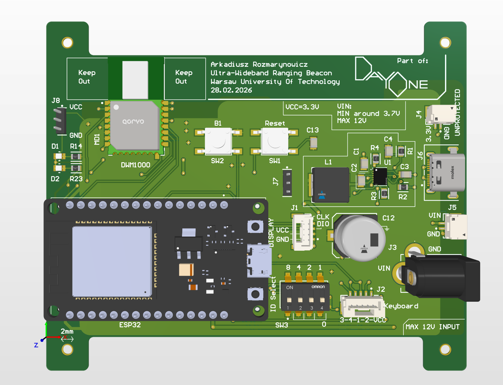

# Design and implementation of a quadrotor with a localization algorithm based on Ultra-Wideband beacons.

My Bachelor's project's task is to build a quadcopter from scratch, implement control and trajectory planning algorithms, synthesize a mathematical model and develop an indoor positioning system. The expected outcome is a functional, maneuverable, and stable drone that is able to follow given trajectories.

The project is also referred to as "Day One".

  
 

## Table of contents
* [General Information](#general-information)
* [UWB Positioning System](#uwb-positioning-system)
* [Current progress](#current-progress)
* [Technologies Used](#technologies-used)

## General information
### Electronics
- An STM32F4 is used as the main MCU.
- An ESP32 onboard provides communication with a ground station and a custom positioning system (described later).
- IMU and a magnetometer support the positioning system in state estimation.
- Power source is a 680mAh, 3S, LiHV, lightweight, and small battery.
- Propellers are mounted on BLDC motors for high efficiency and power.
- Onboard power converter steps the voltage down to 3.3V.
- Safety measures are implemented to protect the device from overcurrent, overvoltage, reverse polarity and ESD events.
- An off-the-shelf ESC drives the motors, commanded by the MCU's DShot signals.

### Control Engineering
- Implementing a:
    - cascade 4-loop PID controller,
    - polynomial decoupled trajectory planning based on given setpoints,
    - Kalman filter state estimator.
- Utilizing quaternions for attitude representation, enabling more stable orientation control.
- Synthesizing a mathematical model of the drone to enable tuning the algorithms in simulation.
- Enabling for manual override of the speed or attitude commands.
- Leaving room for a camera to implement visual odometry and obstacle avoidance in the future.

### Mechanics
- Designing a custom:
    - carbon base plate for the robot,
    - housing for the PCBs,
    - shielding frame around the propellers,
    - battery slot.

## UWB Positioning System
Part of the project is a custom positioning system that doesn't rely on a GPS signal. This is achieved by placing at least 4 Ultra-Wideband (UWB) modules near the area of drone's operation. They measure their distance to the robot and estimate its relative position. This system is almost fully developed, and can be seen in this repository: [https://github.com/A-Rozmarynowicz/UWB_Positioning_System](https://github.com/A-Rozmarynowicz/UWB_Positioning_System).

  
<em>Figure 1: 3D view of the UWB anchor PCB.</em>
 

## Current progress

So far, hardware has been the main focus of development. The main PCB, visible in figure 2, is designed and ordered. It will be soldered at the beggining of July.

  
<em>Figure 2: 3D view of the quadcopter main PCB.</em>
 

The carbon frame is designed and manufactured. Holders for the PCBs and the battery are nearly designed, and are soon to be 3D-printed. The 3D model of the whole quadcopter is visible in figure 3.

  
<em>Figure 3: 3D model of the quadcopter's hardware.</em>
 

## Technologies Used
- Ultra-Wideband radio technology
- Multiple communication protocols: SPI, I2C, UART, ESP-NOW, DShot
- Control engineering:
    - cascade PID
    - polynomial decoupled trajectory calculation
    - Kalman filter

- Programming languages:
    - C
    - C++
    - MATLAB

- Software used:
    - STM32 Cube IDE
    - Altium Designer
    - Autodesk Fusion
    - MATLAB
    - PlatformIO
