# Design and implementation of a quadrotor with a localization algorithm based on Ultra-Wideband beacons.

My Bachelor's project's task is to build a quadcopter from scratch, implement control and trajectory planning algorithms, synthesize a mathematical model, and develop an indoor positioning system. The expected outcome is a functional, maneuverable, and stable drone that is able to follow given trajectories.

Development time: from 01.2026 to 02.2027 (expected).

The project is also referred to as "Day One".

  <picture>
    <source media="(prefers-color-scheme: dark)" srcset="Graphics\Logos\DayOne_Logo_White_on_Github.png">
    <source media="(prefers-color-scheme: light)" srcset="Graphics\Logos\DayOne_Logo_Black_on_White.png">
    
  </picture>

## Table of contents
* [Current progress](#current-progress)
* [General Information](#general-information)
* [UWB Positioning System](#uwb-positioning-system)
* [Technologies Used](#technologies-used)

## Current progress

The quadcopter has been assembled and it passed all the necessary hardware tests. That means the motors work, all chips are soldered correctly, and nothing is overheating. It lifts at around 35% motor power, and the battery lasts around 5 minutes in that setting. The machine is visible below.

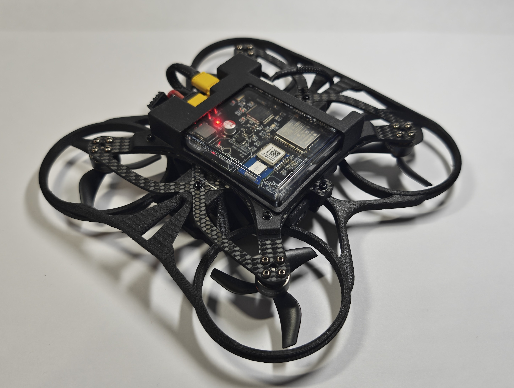  
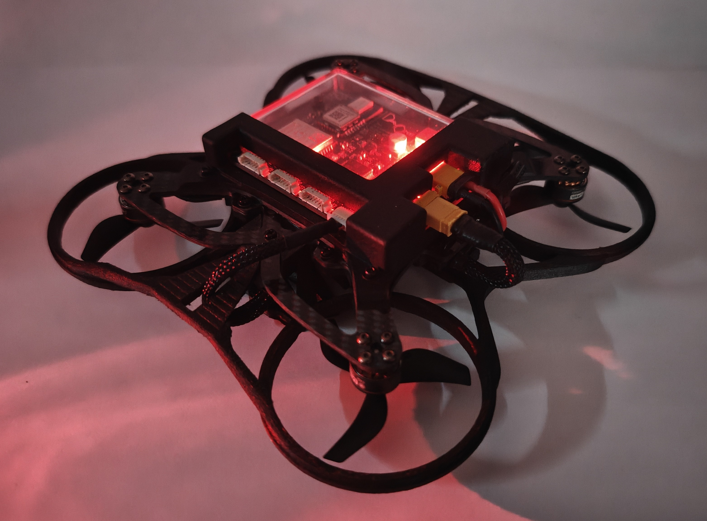
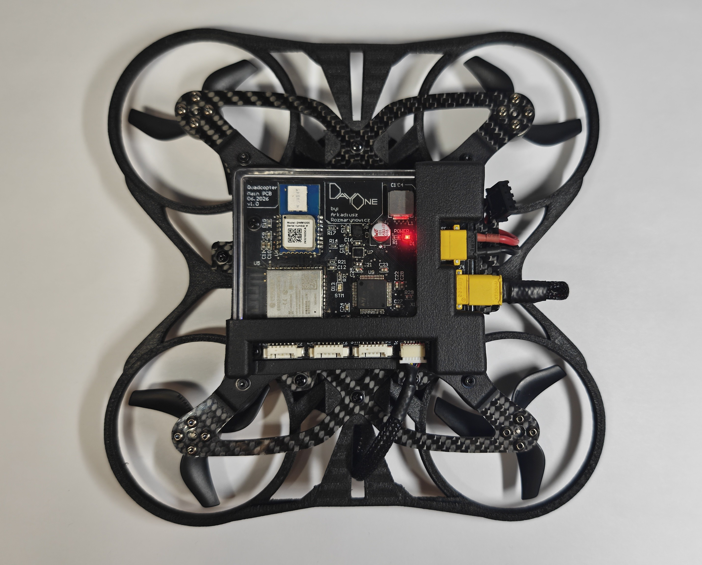  
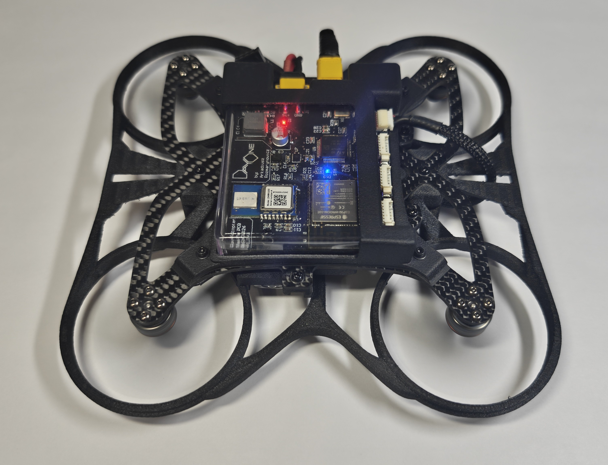  
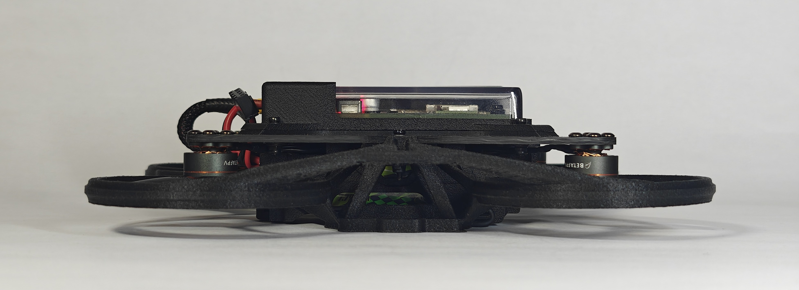  
<em>Figure 1: Quadcopter in real life.</em>
 

The main PCB, visible in Figure 2, has been soldered manually and tested. The schematic document is available in this file: [.../Quadcopter_Main_PCB_Schematic.pdf](./Hardware/Electronics/Documents/Datasheets/Quadcopter_Main_PCB_Schematic.pdf).

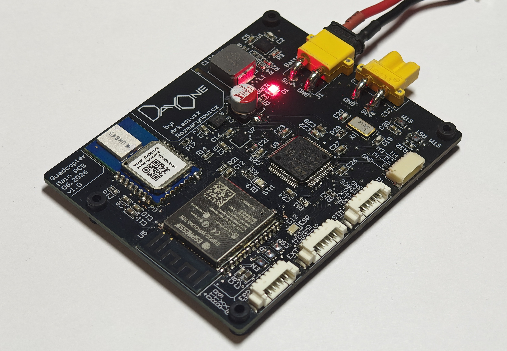  
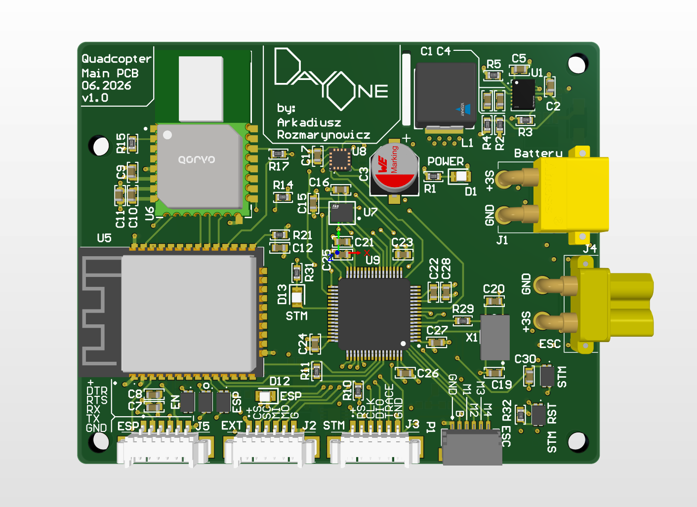  
<em>Figure 2: 3D view of the quadcopter main PCB.</em>
 

The current 3D model of the quadcopter is visible in Figure 3.

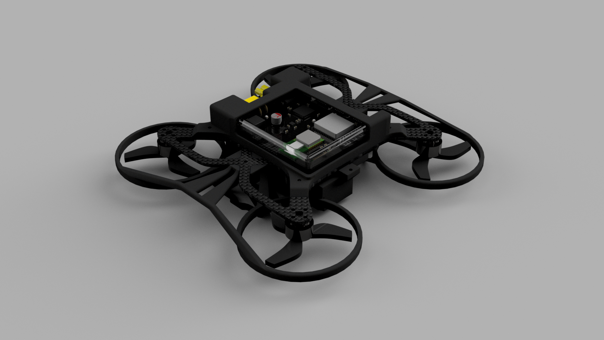  
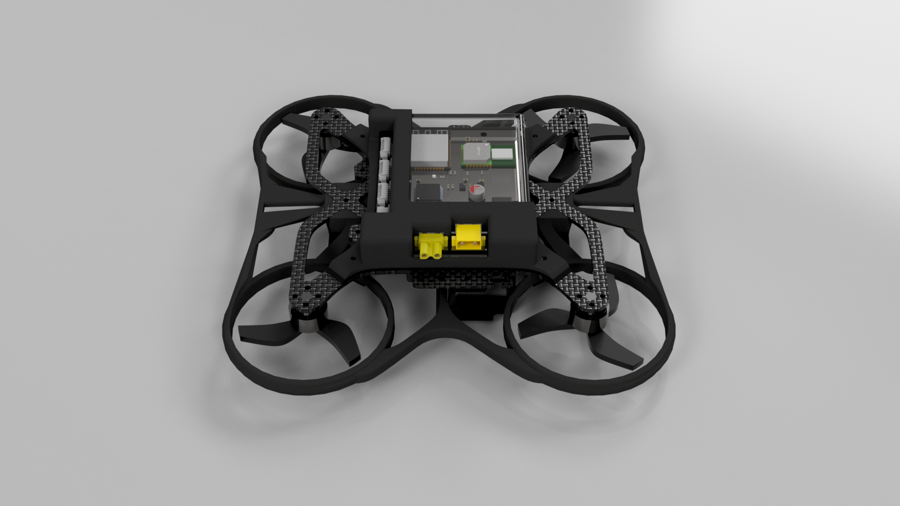  
<em>Figure 3: 3D model of the quadcopter.</em>
 

## General information

### Control Engineering
- Implementing a:
    - cascade 4-loop PID controller,
    - Kalman filter state estimator.
    - If time allows: polynomial decoupled trajectory planning based on given setpoints,
- Utilizing quaternions for attitude representation enabling more stable orientation control.
- If time allows: synthesizing a mathematical model of the drone to enable tuning the algorithms in simulation.
- Enabling manual override of the speed or attitude commands.

### Electronics
- An STM32F4 is used as the main MCU.
- An ESP32 onboard provides communication with a ground station and a custom positioning system (described later).
- IMU and a magnetometer support the positioning system in state estimation.
- Power source is a 680mAh, 3S, LiHV, lightweight, and small battery.
- Propellers are mounted on BLDC motors for high efficiency and power.
- The onboard power converter steps the voltage down to 3.3V.
- Safety measures are implemented to protect the device from overcurrent, overvoltage, reverse polarity, and ESD events.
- An off-the-shelf ESC drives the motors, commanded by the MCU's DShot signals.

### Mechanics
- Designing a custom:
    - carbon base plate for the robot,
    - housing for the PCBs,
    - shielding frame around the propellers,
    - battery slot.
- Total weight turned out to be 242 grams, which fits within the constraints set by the propellers' thrust: the drone lifts at around 35% motor power.

## UWB Positioning System
Part of the project is a custom positioning system that doesn't rely on a GPS signal. This is achieved by placing at least 4 Ultra-Wideband (UWB) modules near the area of the drone's operation. They measure their distance to the robot and estimate its relative position. This system is almost fully developed, and can be seen in this repository: [https://github.com/A-Rozmarynowicz/UWB_Positioning_System](https://github.com/A-Rozmarynowicz/UWB_Positioning_System).

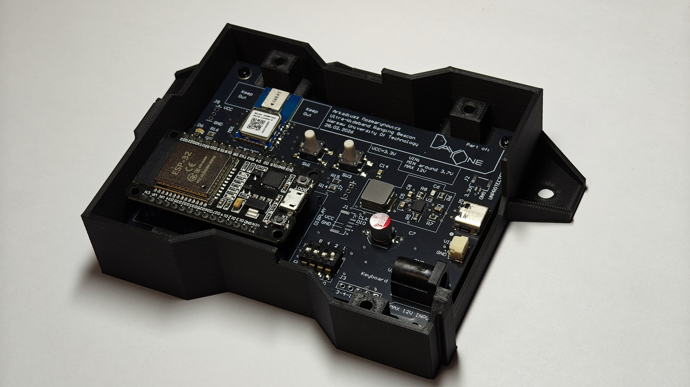
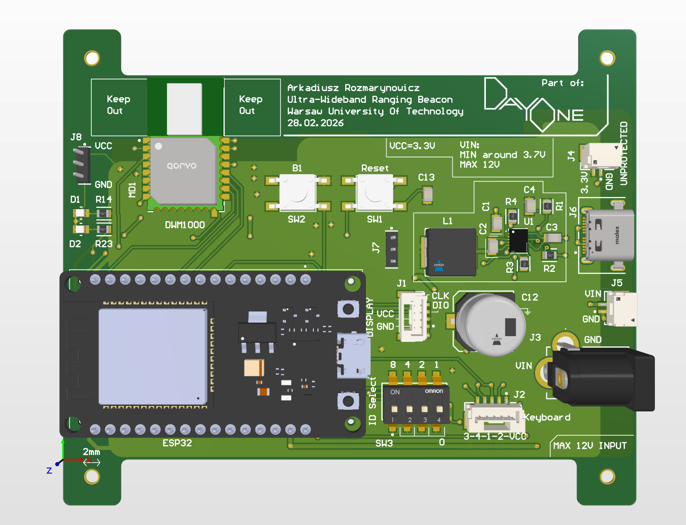  
<em>Figure 4: UWB anchor.</em>
 

## Technologies Used
- Ultra-Wideband radio technology
- Multiple communication protocols: SPI, I2C, UART, ESP-NOW, DShot
- Control engineering:
    - cascade PID
    - polynomial decoupled trajectory calculation
    - Kalman filter

- Programming languages:
    - C
    - C++
    - MATLAB

- Software used:
    - STM32 Cube IDE
    - Altium Designer
    - Autodesk Fusion
    - MATLAB
    - PlatformIO
